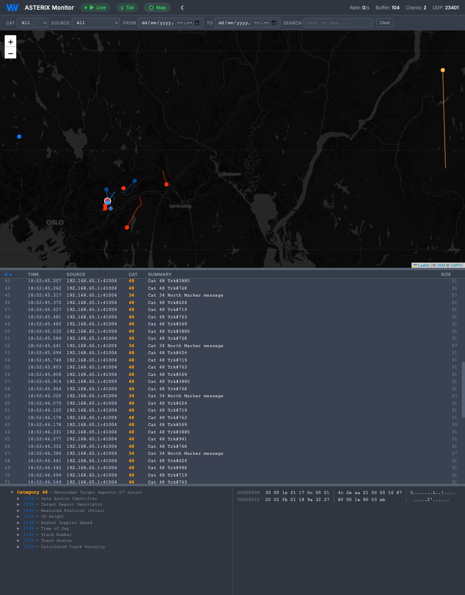
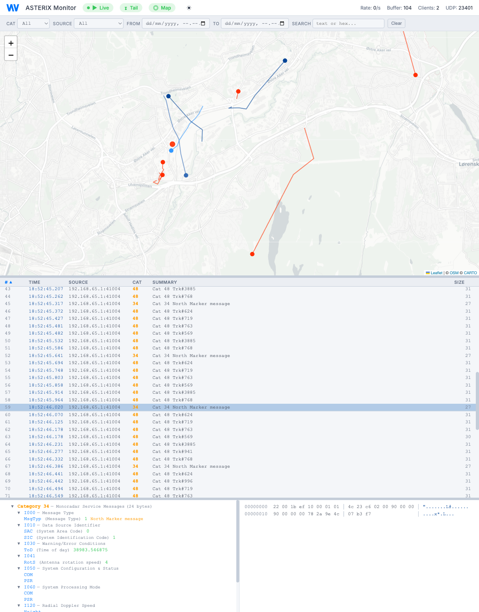

<p align="center">
  <a href="https://weibelventures.com">
    
  </a>
</p>

<h1 align="center">ASTERIX Monitor</h1>

<p align="center">
  A real-time debug tool for <a href="https://www.eurocontrol.int/asterix">EUROCONTROL ASTERIX</a> surveillance data.<br>
  Wireshark-style message inspection meets a live radar map — in a single Docker container.
</p>

<p align="center">
  
</p>

---

## What it does

ASTERIX Monitor receives live ASTERIX radar data over UDP, decodes it in real time, and presents it in a browser-based debug interface. Engineers use it to verify that messages from radar systems are reaching the server, inspect their contents, and visualize track positions on a map.

It was built for the radar integration team at [Weibel Ventures](https://weibelventures.com) to accelerate debugging during system deployment and field testing.

<p align="center">
  
</p>

## Features

**Wireshark-style message inspector**
- Three-pane layout: scrolling message list, collapsible decoded field tree, and hex dump
- Full ASTERIX decoding via [`asterix-decoder`](https://pypi.org/project/asterix-decoder/) — Cat 034, 048, 062, 065, and more
- Click any message to see every data item, sub-field value, and human-readable meaning

**Live Leaflet map**
- Toggleable map panel converts polar radar coordinates (azimuth + range) to lat/lon
- Track trails with per-track coloring, sensor position markers, hover tooltips
- Click a track on the map to select its message in the list below

**Real-time streaming**
- WebSocket pushes full buffer snapshot on connect, then streams new messages as they arrive
- In-memory ring buffer (configurable, default 50k messages)
- Message rate counter and connected client stats

**Filtering and sorting**
- Filter by ASTERIX category, source IP, time range, or free-text search
- Sortable columns (click header to sort, click again to reverse)
- All filter state encoded in the URL hash — shareable links

**Keyboard navigation**
- `Arrow Up / Down` — navigate messages
- `Arrow Right / Left` — expand / collapse all decoded fields
- `Space` — play / pause
- `M` — toggle map

**Theming**
- Dark and light themes following system `prefers-color-scheme`
- Manual toggle persisted in localStorage
- Map tiles switch between CARTO dark and light variants

## Quick start

```bash
docker compose up -d
```

Open [http://localhost:8080](http://localhost:8080) and point your ASTERIX data source at UDP port `23401`.

### Configuration

All settings via environment variables:

| Variable | Default | Description |
|----------|---------|-------------|
| `ASTERIX_UDP_PORT` | `23401` | UDP port for incoming ASTERIX data |
| `WEB_PORT` | `8080` | Web UI and WebSocket port |
| `BUFFER_MAX_MESSAGES` | `50000` | Ring buffer capacity |

```bash
ASTERIX_UDP_PORT=5555 WEB_PORT=9090 docker compose up -d
```

## Architecture

Single Python asyncio process. No external dependencies beyond the Docker image.

```
UDP :ASTERIX_UDP_PORT
    |
    v
+----------------------------------+
|  asyncio event loop              |
|                                  |
|  UDP listener                    |
|    -> asterix.parse(raw_bytes)   |
|    -> ring buffer (deque)        |
|    -> broadcast to WebSocket     |
|                                  |
|  FastAPI (uvicorn)               |
|    GET  /         -> HTML UI     |
|    GET  /api/stats -> JSON       |
|    WS   /ws       -> live stream |
+----------------------------------+
```

## Tech stack

| Component | Choice |
|-----------|--------|
| Backend | Python 3.12, FastAPI, uvicorn |
| ASTERIX parsing | [`asterix-decoder`](https://pypi.org/project/asterix-decoder/) (C extension) |
| Frontend | Single HTML file, vanilla JS, Leaflet.js |
| Map tiles | CARTO (dark/light) |
| Container | `python:3.12-slim` |

## ASTERIX categories

The decoder supports all standard EUROCONTROL ASTERIX categories. The UI is tested with:

| Category | Description | Key fields shown |
|----------|-------------|-----------------|
| **034** | Monoradar Service Messages | Sensor position (lat/lon), rotation period, system status |
| **048** | Monoradar Target Reports | Track number, polar position, flight level, ground speed, heading |
| **062** | SDPS Track Messages | System track data |
| **065** | SDPS Service Status | Service status messages |

## Development

Run without Docker:

```bash
pip install -r requirements.txt
uvicorn app.main:app --host 0.0.0.0 --port 8080
```

The `ASTERIX_UDP_PORT` environment variable controls the UDP listener (default `23401`).

## Contributing

We welcome contributions. If you work with radar systems, surveillance data, or real-time visualization and want to help improve this tool, open an issue or submit a pull request.

## About Weibel Ventures

[Weibel Ventures](https://weibelventures.com) builds and invests in deep-tech companies at the intersection of radar, sensing, and defense technology. We are always looking for talented engineers who want to work on hard problems with real-world impact.

**We're hiring.** If you find this project interesting, check out our open positions at [weibelventures.com](https://weibelventures.com).

## License

MIT
